<!-- ═══════════════════════════════════════════════════════════════
       HEADER · animated wave banner
     ═══════════════════════════════════════════════════════════════ -->

<p align="center">
  
</p>

<!-- ═══════════════════════════════════════════════════════════════
       TYPING ANIMATION
     ═══════════════════════════════════════════════════════════════ -->

<!-- Drawn by scripts/generate_stats.py, not by a third-party service. -->
<p align="center">
  
</p>

<!-- ═══════════════════════════════════════════════════════════════
       SOCIALS
     ═══════════════════════════════════════════════════════════════ -->

<p align="center">
  <a href="https://amantebriwal4321.github.io/My-Portfolio/">
    
  </a>
  <a href="https://www.linkedin.com/in/aman-tebriwal-67855b354">
    
  </a>
  <a href="mailto:amantebriwal104@gmail.com">
    
  </a>
  
</p>

<br />

<!-- ═══════════════════════════════════════════════════════════════
       WHOAMI · terminal block
     ═══════════════════════════════════════════════════════════════ -->

```console
$ whoami --verbose
```

```ts
const aman = {
  role      : "CS undergrad · builder",
  location  : "Bengaluru, India 🇮🇳",
  focus     : ["AI systems", "computer vision", "agentic tooling", "real-time data"],
  stack     : {
    languages : ["Python", "TypeScript", "JavaScript", "Java", "C++"],
    ml        : ["TensorFlow", "Keras", "OpenCV", "MediaPipe", "scikit-learn"],
    web       : ["Next.js", "React", "Node.js", "FastAPI", "Express"],
    data      : ["PostgreSQL", "MongoDB", "Firebase", "Redis"],
    infra     : ["Docker", "GitHub Actions", "Vercel"],
  },
  currently : "shipping StackRadar — a Bloomberg Terminal for your tech stack",
  philosophy: "ship it, measure it, then make it beautiful",
};
```

<br />

<!-- ═══════════════════════════════════════════════════════════════
       TECH ARSENAL
     ═══════════════════════════════════════════════════════════════ -->

##  Tech Arsenal

<div align="center">

**Languages**


**AI / Computer Vision**


**Web & Backend**


**Data & Infra**


</div>

<br />

<!-- ═══════════════════════════════════════════════════════════════
       FEATURED WORK
     ═══════════════════════════════════════════════════════════════ -->

##  Featured Work

<table>
<tr>
<td width="50%" valign="top">

### 📡 [StackRadar](https://github.com/amantebriwal4321/StackRadar)
Real-time tech-intelligence engine. Scores 30+ tools **0–100 by momentum**, mined live from GitHub, Hacker News, Reddit & Dev.to — then maps each one to a learning roadmap.

`FastAPI` `Next.js` `PostgreSQL` `Docker` `Three.js`

</td>
<td width="50%" valign="top">

### 🤟 [SignNova](https://github.com/amantebriwal4321/SignNova)
Real-time American Sign Language → text & speech. CNN gesture recognition across the full A–Z alphabet, with word suggestion and auto-correct built in.

`TensorFlow` `OpenCV` `cvzone` `Keras` `pyttsx3`

</td>
</tr>
<tr>
<td width="50%" valign="top">

### 🎮 [Gesture Motion Arcade](https://github.com/amantebriwal4321/gesture-controlled-motion-arcade-3d-mediapipe-threejs)
A 3D arcade you play with your hands. MediaPipe hand tracking drives a Three.js scene — no controller, no keyboard.

`MediaPipe` `Three.js` `TypeScript` `WebGL`

</td>
<td width="50%" valign="top">

### ♻️ [GreenChain Conserve](https://github.com/amantebriwal4321/greenchain-conserve)
IoT waste-disposal tracking. Smart bins stream sensor telemetry to a backend that stores, aggregates and visualises disposal patterns.

`TypeScript` `IoT` `Node.js` `Sensors`

</td>
</tr>
<tr>
<td width="50%" valign="top">

### 🚀 [RocketRide Server](https://github.com/amantebriwal4321/rocketride-server)
High-performance AI pipeline engine with a **C++ core** — built for throughput where Python alone would stall.

`C++` `Systems` `Pipelines`

</td>
<td width="50%" valign="top">

### 🏟️ [Stadium Virtual AI Assistant](https://github.com/amantebriwal4321/Stadium_Virtual__AI_Assistant)
GenAI **multi-agent** assistant for international stadium visitors — navigation, translation and live event context in one flow.

`Python` `GenAI` `Multi-Agent`

</td>
</tr>
</table>

<div align="center">
  <a href="https://github.com/amantebriwal4321?tab=repositories">
    
  </a>
</div>

<br />

<!-- ═══════════════════════════════════════════════════════════════
       STATS
     ═══════════════════════════════════════════════════════════════ -->

##  By the Numbers

<blockquote>
Every graphic below is drawn inside this repository by a scheduled action and
committed as a plain SVG. No third-party widgets, nothing that can rate-limit
or go dark.
</blockquote>

<div align="center">






</div>

<!-- ═══════════════════════════════════════════════════════════════
       THE YEAR · one character per day
     ═══════════════════════════════════════════════════════════════ -->

<div align="center">
  
</div>

<br />

<!-- ═══════════════════════════════════════════════════════════════
       NOW / NEXT
     ═══════════════════════════════════════════════════════════════ -->

##  Currently

```yaml
building:   StackRadar — momentum scoring + learning roadmaps for developers
exploring:  agentic workflows, multi-agent orchestration, edge vision (OpenMV)
learning:   distributed systems, C++ performance work, production ML pipelines
open_to:    internships · open-source collaboration · anything ambitious
ask_me_about:
  - computer vision pipelines that run in real time
  - turning a scraper into a scoring engine
  - making a side project actually look shipped
```

<br />

<!-- ═══════════════════════════════════════════════════════════════
       FOOTER
     ═══════════════════════════════════════════════════════════════ -->

<div align="center">

### 💬 Let's build something

<a href="https://www.linkedin.com/in/aman-tebriwal-67855b354">
  
</a>
<a href="mailto:amantebriwal104@gmail.com">
  
</a>

<br /><br />

<i>"Ship it, measure it, then make it beautiful."</i>

</div>

<p align="center">
  
</p>
